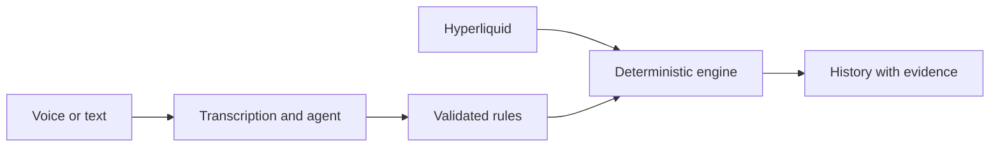

# Hype Radar

[Español](README.md) / **English**

**Market alerts with evidence.** Describe a condition by voice or text and monitor it on Hyperliquid.

[](pitch-deck/Hype-Radar-Pitch.pdf)

## Pitch deck

Spanish presentation: [animated PowerPoint](pitch-deck/Hype-Radar-Pitch.pptx) and [12-slide PDF](pitch-deck/Hype-Radar-Pitch.pdf).

## What the MVP does

- Charts, order book, and recent trades for BTC, ETH, SP500, XYZ100, and BRENTOIL.
- Voice and text assistant to query the market and create alerts.
- Price, open-interest, and funding rules, with liquidity and data-freshness checks.
- Panel to pause or resume alerts and inspect each event's evidence.

> Create an alert for BTC when open interest rises 5% over 15 minutes. Block the event if the spread exceeds 10 basis points.

## How it works

Whisper transcribes voice and the language agent, using DeepSeek by default, calls tools to read data and create rules. The user reviews the transcript before sending it. A deterministic engine evaluates the rules; AI does not decide whether a condition is met.



The application uses React and TypeScript, FastAPI, PostgreSQL, and LangChain with OpenRouter.

## Run locally

You need **Python 3.12+, Node.js 22.12+, Docker, and [uv](https://docs.astral.sh/uv/)**.

### 1. Prepare the backend

From the repository root, on first setup:

```sh
docker compose up -d postgres
cd backend
cp .env.example .env
uv sync --locked
uv run alembic upgrade head
```

Add your `OPENROUTER_API_KEY` to `backend/.env` to enable chat and voice. Models already have defaults; market data does not require this key.

### 2. Start the backend

From `backend/`:

```sh
uv run uvicorn main:app --host 127.0.0.1 --port 8000 --workers 1
```

Keep **one worker**. PostgreSQL must remain running.

### 3. Start the frontend

In another terminal, from the repository root:

```sh
cd frontend
npm ci
npm run dev
```

Open **http://127.0.0.1:5173**. Explore the API at **http://127.0.0.1:8000/docs**.

## Checks

From `backend/`:

```sh
uv run python -m unittest -v
```

From `frontend/`:

```sh
npm run build
```

## Current scope

- Shared instance with web history. Per-user accounts and external Telegram delivery are pending.
- Monitoring without trade execution or trading credentials.
- HIP-3 markets are perpetuals, not official underlying quotations. Rules may need earlier observations, and events can be blocked when data quality is insufficient.

## Deployment

See the [Docker production guide](docs/deployment.md) and [AWS demo infrastructure](infra/terraform/README.md).
