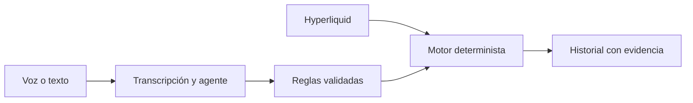

# Hype Radar

**Español** / [English](README.en.md)

**Alertas de mercado con evidencia.** Describe una condición por voz o texto y sigue su evolución en Hyperliquid.

[](pitch-deck/Hype-Radar-Pitch.pdf)

## Pitch deck

Presentación en español: [PowerPoint animado](pitch-deck/Hype-Radar-Pitch.pptx) y [PDF de 12 diapositivas](pitch-deck/Hype-Radar-Pitch.pdf).

## Qué hace el MVP

- Gráficos, libro de órdenes y operaciones recientes de BTC, ETH, SP500, XYZ100 y BRENTOIL.
- Asistente por voz y texto para consultar el mercado y crear alertas.
- Reglas de precio, interés abierto y financiación, con comprobaciones de liquidez y antigüedad de los datos.
- Panel para pausar o reanudar alertas y revisar la evidencia de cada evento.

> Crea una alerta para BTC cuando el interés abierto suba un 5 % en 15 minutos. Bloquea el evento si el diferencial supera 10 puntos básicos.

## Cómo funciona

Whisper transcribe la voz y el agente de lenguaje, con DeepSeek por defecto, utiliza herramientas para consultar datos y crear reglas. El usuario revisa la transcripción antes de enviarla. Un motor determinista evalúa las reglas; la IA no decide si se cumple una condición.



La aplicación utiliza React y TypeScript, FastAPI, PostgreSQL y LangChain con OpenRouter.

## Ejecución local

Necesitas **Python 3.12+, Node.js 22.12+, Docker y [uv](https://docs.astral.sh/uv/)**.

### 1. Preparar el backend

Desde la raíz del repositorio, en la primera ejecución:

```sh
docker compose up -d postgres
cd backend
cp .env.example .env
uv sync --locked
uv run alembic upgrade head
```

Añade tu `OPENROUTER_API_KEY` a `backend/.env` para habilitar el chat y la voz. Los modelos ya tienen valores predeterminados; los datos de mercado no requieren esa clave.

### 2. Arrancar el backend

Desde `backend/`:

```sh
uv run uvicorn main:app --host 127.0.0.1 --port 8000 --workers 1
```

Mantén **un solo worker**. PostgreSQL debe seguir en ejecución.

### 3. Arrancar el frontend

En otra terminal, desde la raíz del repositorio:

```sh
cd frontend
npm ci
npm run dev
```

Abre **http://127.0.0.1:5173**. La API se puede explorar en **http://127.0.0.1:8000/docs**.

## Comprobaciones

Desde `backend/`:

```sh
uv run python -m unittest -v
```

Desde `frontend/`:

```sh
npm run build
```

## Alcance actual

- Instancia compartida con historial web. Las cuentas por usuario y la entrega externa por Telegram están pendientes.
- Monitorización sin ejecución de operaciones ni credenciales de trading.
- Los mercados HIP-3 son perpetuos, no cotizaciones oficiales del subyacente. Una regla puede necesitar observaciones previas y un evento puede quedar bloqueado por calidad insuficiente.

## Despliegue

Consulta la [guía de producción con Docker](docs/deployment.md) y la [infraestructura de demostración en AWS](infra/terraform/README.md), ambas en inglés.
